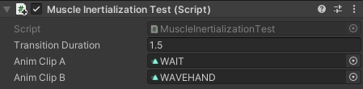
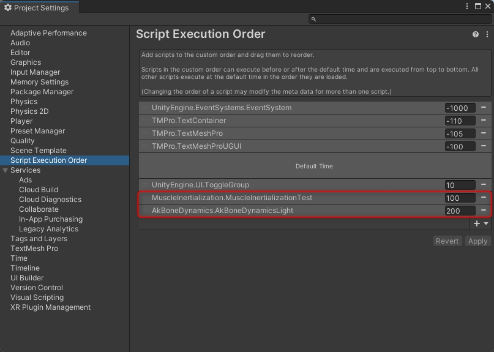

## Muscle Inertialization
  

Inertial interpolation by human muscle values.  

Interpolate with the properties of the [HumanPose class](https://docs.unity3d.com/ScriptReference/HumanPose.html).  
"muslces" are float interpolated, only "bodyPosition" and "bodyRotation" are interpolated by Vector3 and Quaternion.

> **Note**  
> This project is for learning and experimental purposes. Please note that it is not designed to be implemented as-is in games, etc. 

  

### [MuscleInertializationTest.cs](.Assets/MuscleInertialization/MuscleInertializationTest.cs)
Set animation clip to AnimClipA and AnimClipB. Pressing [A] or [B] key toggles animation.  

  

### Script Execution Order
MuscleInertialization calculates animation differences with LateUpdate. If bone dynamics or similar is used, script execution order must be changed so that it is evaluated after MuscleInertialization.  

  

## References
* [Inertialization: High-Performance Animation Transitions in 'Gears of War'](https://www.gdcvault.com/play/1025331/Inertialization-High-Performance-Animation-Transitions)  
* [慣性ベースドなアニメーションブレンド（解説編）](https://hogetatu.hatenablog.com/entry/2018/06/02/185613)  
* [慣性ベースドなアニメーションブレンド（実装編）](https://hogetatu.hatenablog.com/entry/2018/06/10/232856)  
* [慣性補間によるアニメーション遷移を実装してみた](https://hexadrive.jp/hexablog/program/111655/)